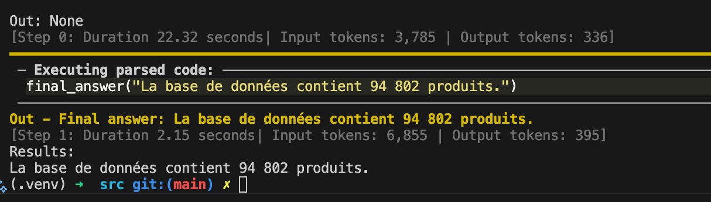

# IFT-6005 - Conversational Agent Project

<video src="https://drive.google.com/file/d/1BRhfKyAbzxcwmkuie8dG8HN_38NGwqPx/view?usp=sharing"></video>

A conversational agent for querying the Open Food Facts database using Hugging Face's smolagents library. 
Developed as part of IFT-6005 Integration Project at Université Laval.

## Features

- Built with 🤗 Hugging Face's [smolagents](https://github.com/huggingface/smolagents) library
- Support for complex food-related queries
- Semantic search in database (coming soon)
- Search for complementary information in the Canada Food Guide
- Data visualization capabilities (coming soon)
- Interactive conversation history (coming soon)
  
## Installation

```bash
# Create virtual environment
python -m venv venv
source venv/bin/activate  # On macOS/Linux

# Install dependencies
pip install -r requirements.txt
```

Setup your secrets in a `.env` file:

```bash
ANTHROPIC_API_KEY
```

## Usage

```python
def run(prompt: str) -> None:
    response = manager_agent.run(
        prompt,
        additional_args={
            "additional_notes": ADDITIONAL_NOTES,
        }
    )
    print(f"Results:\n{response}")

if __name__ == "__main__":
    prompt = "Combien de produits dans la base de données?"
    run(prompt)
```

This will run the conversational agent with the specified prompt. You should see the results like this:



## Project Structure

```markdown
ift-6005/
├── data/              Data used in the project
├── docs/
│   ├── data/          Information about the data used in the project
│   ├── latex/         LaTeX files for the project report
│   └── markdown/      Markdown files for the project documentation
├── notebooks/         Jupyter notebooks for data exploration
├── src/               Source code
│   └── experiments/   Experiments
├── tests/
├── requirements.txt
└── README.md
```

## Development

- Code quality and formatting: Black, Flake8, Pylint 
- Testing: pytest

## Contributions are welcome

If you found a bug 🐛 in this site, please [open an issue](https://github.com/boisalai/ift-6005/issues) and describe the problem.

## License

MIT License - See LICENSE file for details.
