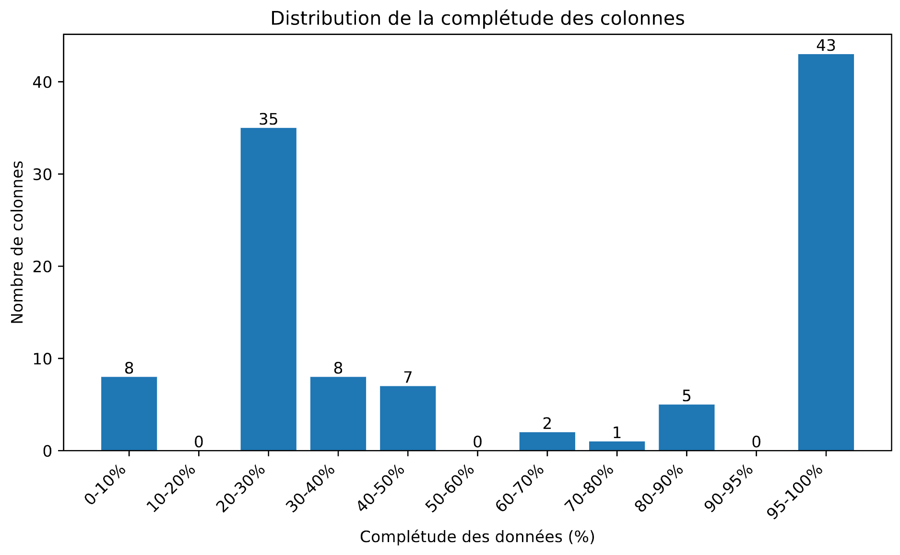

# Rapport de mi-session

## 1. Introduction

L'accès aux informations nutritionnelles reste souvent limité par des interfaces techniques nécessitant des compétences en langages de requête comme SQL. Cette barrière empêche de nombreux utilisateurs d'exploiter pleinement des bases de données comme Open Food Facts, qui contient des milliers de fiches produits détaillées. Ce projet vise à développer un agent conversationnel utilisant des grands modèles de langage (LLM) pour permettre aux utilisateurs de poser des questions en langage naturel comme "Quelles collations sans allergènes ont un Nutri-score A ?". Cette approche démocratise l'accès aux données nutritionnelles tout en améliorant la qualité des réponses grâce à l'exploitation directe de sources structurées. Ce rapport présente l'état d'avancement du projet à la mi-session, les défis rencontrés et les solutions implémentées.

## 2. Rappel de l'objectif du projet

L'objectif de ce projet est de développer un agent conversationnel permettant aux utilisateurs d'interroger la base de données Open Food Facts en langage naturel. Le système doit comprendre les questions des utilisateurs sur les produits alimentaires, les convertir en requêtes SQL, et fournir des réponses claires et précises. Les données manquantes ou incomplètes doivent être compensées par une recherche alternative dans le Guide alimentaire canadien.

## 3. Approche proposée et options considérées

### 3.1 Architecture modulaire

L'approche retenue repose sur une architecture modulaire facilitant le développement itératif, les tests, et l'évolution du système. Cette architecture comprend quatre composants clés interconnectés :

- **Module de dialogue** : Responsable de maintenir le contexte conversationnel et de gérer les interactions avec l'utilisateur. J'ai implémenté ce composant en utilisant un LLM pré-entraîné capable d'utiliser des outils.
- **Convertisseur texte-SQL** : Transforme les questions en langage naturel en requêtes SQL adaptées à la structure de la base de données Open Food Facts. Ce module s'appuie sur une recherche préalable dans un dictionnaire de données pour identifier les colonnes pertinentes pour chaque requête.
- **Connecteur de base de données** : Interface avec DuckDB pour l'exécution des requêtes. Les requêtes SQL générées par l'agent LLM sont validées avant exécution pour garantir leur sécurité.
- **Générateur de réponses** : Transforme les résultats bruts en réponses naturelles et contextuelles, incluant des explications sur les sources et les limites des données lorsque nécessaire.

### 3.2 Stratégie de recherche séquentielle

Pour assurer une progression cohérente dans la démarche, j'ai implémenté une stratégie de recherche séquentielle à trois niveaux :

- **Recherche principale dans la base de données** : Après une recherche sémantique pour identifier les colonnes pertinentes, l'agent génère et exécute une première requête SQL.
- **Requêtes alternatives** : En cas d'échec ou de résultats incomplets, l'agent formule des requêtes SQL alternatives utilisant d'autres colonnes ou approches.
- **Recherche complémentaire** : Si les données restent insuffisantes, l'agent se tourne vers le Guide alimentaire canadien pour compléter l'information.

Cette progression permet de maximiser l'utilisation des données structurées tout en assurant qu'une réponse utile est toujours fournie à l'utilisateur.

### 3.3 Sélection des technologies

Après évaluation de plusieurs options, j'ai retenu les technologies suivantes :

- **DuckDB** comme solution de base de données, pour plusieurs raisons :
  - Excellente performance pour les requêtes analytiques sur des données volumineuses
  - Gestion efficace de la mémoire, adaptée à un environnement de développement local
  - Support natif des fichiers Parquet et des requêtes SQL complexes
  - Facilité d'intégration avec Python et capacité à gérer des structures de données complexes
- **Smolagents de Hugging Face** comme framework d'agent conversationnel :
  - Simplicité d'utilisation par rapport à d'autres solutions comme CrewAI
  - Approche optimisée pour les "agents de code" (agents qui génèrent et exécutent du code)
  - Flexibilité dans l'intégration de différents LLMs et outils
  - Support actif et documentation de qualité
  - Cours récent de Hugging Face sur cette technologie
- **Modèles de langage** :
  - Pour le développement : `ollama/llama3.1:8b-instruct-q8_0` (modèle open-source pouvant s'exécuter localement)
  - Pour la production : `anthropic/claude-3-5-sonnet` (modèle plus puissant offrant une meilleure compréhension et génération)
  - Cette approche double permet de limiter les coûts d'API
- **FAISS** pour la recherche sémantique :
  - Identification efficace des colonnes pertinentes pour chaque question
  - Vectorisation de la documentation des colonnes de la base de données pour faciliter la recherche
  - En fait, je n'ai pas considéré d'autres options. J'ai choisi FAISS (Facebook AI Similarity Search) car il est bien documenté, open source et largement utilisé dans la communauté de recherche en IA. Il est également compatible avec les modèles de langage MiniLM, ce qui en fait un choix naturel pour ce projet.

### 3.4 Gestion des données

La préparation des données a impliqué :

- Utilisation de la base de données Open Food Facts en format Parquet et création d'une base de données DuckDB
- Filtrage pour ne conserver que les produits canadiens (94 802 produits)
- Documentation détaillée des 109 colonnes de la base de données
- Création d'embeddings pour chaque colonne afin de faciliter la recherche sémantique

### 3.5 Évaluation et optimisation

Le système implémente trois métriques principales d'évaluation :

- **Précision d'exécution (EX)** : Mesure si les requêtes SQL générées produisent les résultats attendus
- **Taux de couverture des données manquantes (TCM)** : Évalue la capacité du système à fournir des réponses pertinentes malgré l'absence de certaines données
- **Temps de réponse moyen (TRM)** : Mesure le temps total nécessaire pour traiter une requête

Ces métriques serviront de guide pour l'optimisation continue du système.

## 4. État d'avancement et tâches réalisées

Le développement de l'agent conversationnel a progressé significativement durant cette première phase du projet. Cette section détaille les différentes tâches accomplies et leur état d'avancement, en suivant le plan initial.

### 4.1 Mise en place de l'environnement de développement

La première étape du projet a consisté à établir un environnement de développement pour le développement du projet.

- **Infrastructure et outils**
  - Création d'un dépôt GitHub pour le versionnement du code et la documentation
  - Configuration d'un environnement virtuel Python avec les versions spécifiques des dépendances
  - Mise en place d'outils de développement comme Black pour le formatage du code et Pylint pour l'analyse statique
  - Configuration des hooks pre-commit pour maintenir la qualité du code
- **Dépendances principales**
  - Installation de DuckDB (v1.2.0) pour la gestion des requêtes SQL
  - Configuration de smolagents (v1.9.2) comme framework d'agent conversationnel
  - Intégration de FAISS (v1.10.0) pour la recherche sémantique
  - Installation des bibliothèques d'analyse de données (pandas, numpy) et de traitement de langage naturel (sentence-transformers)
- **Configuration des API**
  - Mise en place des variables d'environnement pour les clés API (ANTHROPIC_API_KEY) dans un fichier `.env`
  - Configuration de l'accès à l'API d'Anthropic pour Claude 3.5 Sonnet
  - Configuration de l'interface avec Ollama pour les tests locaux avec llama3.1

### 4.2 Préparation de la base de données

D'abord, j'ai procédé au téléchargement du fichier Parquet d'Open Food Facts (3,6 millions de produits) et l'ai converti en base de données DuckDB pour faciliter les requêtes SQL.

```bash
wget -P data/ https://huggingface.co/datasets/openfoodfacts/product-database/resolve/main/food.parquet
```

```python
DATA_DIR = Path("../data")
PARQUET_PATH = DATA_DIR / "food.parquet"
FULL_DB_PATH = DATA_DIR / "food_full.duckdb"

con = duckdb.connect(str(FULL_DB_PATH), config={'memory_limit': '8GB'})
con.execute(f"CREATE TABLE products AS SELECT * FROM '{PARQUET_PATH}'")
con.close()
```

Pour réduire les temps de traitement tout en conservant la pertinence pour le contexte canadien, j'ai créé une version filtrée contenant uniquement les 94 802 produits disponibles au Canada. Cette approche a permis d'accélérer considérablement les requêtes sans compromettre la qualité des réponses pour les utilisateurs canadiens.

```python
FILTERED_DB_PATH = DATA_DIR / "food_canada.duckdb"

con = duckdb.connect(str(FILTERED_DB_PATH))
con.execute(f"ATTACH DATABASE '{FULL_DB_PATH}' AS full_db")
con.execute(f"""
    CREATE TABLE products AS 
    SELECT * FROM full_db.products
    WHERE array_contains(countries_tags, 'en:canada')
""")
```

J'ai également effectué une analyse approfondie de la complétude des données, identifiant une distribution bimodale avec certaines colonnes très complètes (>95%) et d'autres peu renseignées (<30%).



Un autre défi majeur identifié lors de l'analyse des données concerne la structure hétérogène et complexe de certaines colonnes. Par exemple, la colonne "categories" contient du texte libre avec des valeurs multiples séparées par des virgules :

```
"Sweeteners,Syrups,Simple syrups,Agave syrups"
"Plant-based beverages,Fruit-based,Juices and nectars,Fruit juices,Lemon juice"
"Snacks,Sweet snacks,Biscuits and cakes,Cakes"
```

Tandis que la colonne parallèle "categories_tags" stocke les mêmes informations sous forme de tableaux avec des identifiants standardisés incluant des préfixes de langue :

```
["en:plant-based-foods-and-beverages", "en:beverages", "en:plant-based-beverages", "en:coconut-milks"]
["en:snacks", "en:sweet-snacks", "en:cocoa-and-chocolate-products", "en:chocolates"]
["en:dairies", "en:milk", "en:whole-milk"]
```

Pour gérer ces structures complexes, j'ai créé un fichier "columns_documentation.json" qui sert de référence à l'agent, lui permettant de générer des requêtes SQL adaptées en utilisant des fonctions DuckDB spécifiques comme `UNNEST()` et `list_contains()`. Cette documentation détaillée guide l'agent dans la création de requêtes optimisées selon la nature exacte des colonnes interrogées.

Cependant, je compte réfléchir davantage au cours des prochaines semaines sur une façon plus optimale d'instruire l'agent LLM sur le contenu de ces colonnes et comment les exploiter. L'approche actuelle, bien que fonctionnelle, pourrait être améliorée pour permettre une compréhension plus intuitive des structures de données complexes par l'agent, réduisant ainsi le besoin d'instructions explicites et augmentant sa capacité à générer des requêtes pertinentes de manière autonome.

### 4.3 Documentation des données

J'ai créé un dictionnaire de données détaillé en format JSON pour guider l'agent dans la génération de requêtes SQL. Ce dictionnaire contient des informations sur chacune des 109 colonnes de la base de données.

Documentation pour chaque colonne :

```python
{
    "type": "Type de données du schéma DuckDB",
    "description": "Description claire de la colonne",
    "examples": [
        "Exemple 1",
        "Exemple 2",
        "Exemple 3"
    ],
    "is_nullable": true/false,
    "common_queries": [
        {
            "description": "Description de l'objectif de la requête",
            "sql": "Exemple de requête SQL"
        },
        // Exactement 3 requêtes par colonne
    ]
}
```

La documentation des colonnes de la base de données est générée par un agent. Pour chaque colonne, l'agent :

- Interroge la colonne dans la base de données
- Recherche des informations supplémentaires sur la colonne sur le site Open Food Facts
- Propose une description de la colonne
- Génère des requêtes SQL typiques pour la colonne
- Ajoute la documentation de la colonne au fichier `columns_documentation.json`

Le script est `docoff.py`.

### 4.4 Création du jeu de test

Le processus de génération de questions-réponses utilise les requêtes SQL précédemment documentées dans `columns_documentation.json` pour créer des paires question-réponse réalistes. Chaque requête est analysée pour déterminer si elle représente une question significative pour un consommateur sur les produits alimentaires. Encore ici, j'ai demandé à un agent LLM :

Le processus suit ces étapes :

- Chargement des requêtes depuis la documentation :
- Pour chaque requête SQL de la documentation, l'agent :
  - Évalue la pertinence de la requête :
    - Détermine si la requête répond à une vraie question de consommateur
    - Vérifie si les résultats fournissent des informations exploitables sur les aliments
    - Vérifie la pertinence pratique pour les consommateurs
    - Critères de rejet automatique :
  - Requêtes de métadonnées de base de données
    - Statistiques de qualité des données
    - Requêtes de maintenance technique
    - Requêtes d'identifiants internes
    - Pour les requêtes pertinentes :
  - Génère des questions naturelles en français et en anglais
    - Crée des réponses claires orientées consommateur
    - Valide que les résultats de la requête soutiennent les réponses
- Sauvegarde des paires Q&A :
  - Stocke les paires question-réponse dans un format structuré
  - Inclut des métadonnées pour l'évaluation et le suivi

Les paires Q&A sont stockées dans qa_pairs.json avec la structure suivante :

```json
{
    "column": "nutriscore_grade",
    "sql": "SELECT code, product_name FROM products WHERE...",
    "questions": {
        "fr": "Quels produits ont un Nutri-Score A?",
        "en": "Which products have a Nutri-Score A?"
    },
    "answers": {
        "fr": "Les produits suivants ont un Nutri-Score A...",
        "en": "The following products have a Nutri-Score A..."
    }
}
// ... plus de paires Q&A
```

Le processus est implémenté dans le script `question_answer.py`.

### 4.5 Développement de la recherche sémantique

La recherche sémantique constitue un pilier essentiel pour permettre à l'agent d'identifier les colonnes pertinentes de la base de données en fonction des questions utilisateur. Cette fonctionnalité a été implémentée à l'aide de FAISS (Facebook AI Similarity Search), couplé au modèle de langage `all-MiniLM-L6-v2` de Sentence Transformers pour la génération d'embeddings.

Pour ce faire, j'ai suivi les étapes suivantes :

- **Préparation des embeddings** :
  - La documentation structurée des 109 colonnes (stockée dans `columns_documentation.json`) est convertie en représentations vectorielles. Chaque entrée combine le nom de la colonne, son type, sa description et des exemples de requêtes SQL.
  - Le modèle MiniLM génère des embeddings de dimension 384, optimisant le compromis entre précision et performance. Ce modèle, identifiable par le préfixe "all-", est spécifiquement conçu pour supporter plusieurs langues, dont le français et l'anglais, permettant ainsi de traiter efficacement les requêtes utilisateur indépendamment de la langue utilisée.
- **Indexation FAISS** :
  - Un index FlatIP (Inner Product) est créé pour permettre des recherches rapides par similarité cosinus.
  - Mécanisme de cache : Les embeddings et métadonnées sont persistés dans des fichiers (`docs_faiss.index` et `columns_metadata.json`) pour éviter de recalculer l'index à chaque exécution.
- **Processus de recherche** :
  - Pour chaque question utilisateur (ex: *"Quelles céréales ont une faible teneur en sucre ?"*), l'embedding de la question est comparé à ceux des colonnes.
  - Les 5 colonnes les plus similaires sont retournées avec leur score de pertinence (0-1), triées par ordre décroissant.
  - Seules les colonnes avec un score > 0.5 sont retenues pour la génération de requêtes SQL.

Les résultats de la recherche sémantique sont injectés dynamiquement dans le prompt de l'agent sous forme de contexte structuré. Par exemple, pour une question sur les allergènes, l'agent reçoit automatiquement les descriptions des colonnes `allergens_tags`, `traces_tags` et `ingredients_analysis_tags`, accompagnées d'exemples de requêtes SQL typiques.

Cette méthode de recherche sémantique s'inspire directement du concept d'apprentissage contextuel (*In-Context Learning*) pour Text-to-SQL, récemment formalisé par Gao et al. (2023). Contrairement aux approches qui sélectionnent des paires complètes question-SQL comme exemples, j'ai adapté cette méthode pour cibler spécifiquement les colonnes pertinentes de la base de données Open Food Facts.

Cette adaptation est particulièrement appropriée pour le présent cas d'usage où la principale difficulté réside dans l'identification des colonnes pertinentes parmi les 109 disponibles, dont beaucoup présentent des structures complexes. En fournissant au LLM des informations détaillées sur les colonnes les plus similaires à la question posée, ainsi que des exemples de requêtes SQL typiques utilisant ces colonnes, je lui donne le contexte nécessaire pour générer des requêtes précises sans avoir à être spécifiquement entraîné sur cette tâche.

### 4.6 Création des outils d'agent

Les agents d'IA sont des programmes qui utilisent des LLMs pour générer des 'pensées' basées sur des 'observations' afin d'effectuer des 'actions'.

Nous avons choisi `smolagents`, l'un des nombreux frameworks d'agents open-source disponibles pour le développement d'applications. D'autres options incluent LlamaIndex et LangGraph. Smolagents a été sélectionné pour sa simplicité, sa flexibilité et le support actif de sa communauté. `smolagents` est idéal pour prototyper ou expérimenter rapidement avec la logique d'agent, particulièrement lorsque votre application est relativement simple.

De plus, contrairement à d'autres frameworks où les agents écrivent des actions en JSON, smolagents se concentre sur des appels d'outils en code, simplifiant le processus d'exécution. Ceci est dû au fait qu'il n'y a pas besoin d'analyser le JSON pour construire du code qui appelle les outils : la sortie peut être exécutée directement. Un autre avantage est que smolagents permet de télécharger des agents et des outils sur le Hugging Face Hub pour que d'autres puissent les réutiliser.

Pour notre projet, nous avons développé trois outils complémentaires :

- **Recherche documentaire sémantique** : Cet outil utilise FAISS et des embeddings vectoriels pour identifier les colonnes de la base de données Open Food Facts les plus pertinentes pour chaque question utilisateur. Il fournit ensuite au LLM des descriptions détaillées de ces colonnes ainsi que des exemples de requêtes SQL typiques les utilisant. Cette approche permet au LLM de comprendre rapidement les structures de données complexes sans avoir à mémoriser l'ensemble du schéma.
- **Exécution SQL sécurisée** : Connecté directement à DuckDB, cet outil permet à l'agent de générer et d'exécuter des requêtes SQL. Il intègre une couche de validation qui assure la sécurité et l'efficacité des requêtes en détectant les erreurs de syntaxe et en prévenant les requêtes potentiellement dangereuses ou inefficaces.
- **Recherche externe complémentaire** : Reconnaissant les limites inhérentes à toute base de données, cet outil permet à l'agent de consulter le Guide alimentaire canadien lorsque les informations nutritionnelles requises ne sont pas disponibles dans Open Food Facts. Cela garantit une réponse complète même face à des données incomplètes.

Ces trois outils sont orchestrés via la bibliothèque **smolagents** de Hugging Face, qui permet à l'agent de déterminer automatiquement quel outil utiliser en fonction de la question posée. Cette architecture modulaire facilite également l'ajout de nouvelles fonctionnalités et la maintenance du système à long terme.

Cette approche multi-outils s'inscrit dans la méthodologie de recherche séquentielle décrite dans la section 3.2, garantissant une progression logique du traitement de la requête, depuis la consultation de la base de données jusqu'aux sources externes si nécessaire.

### 4.7 Stratégie d'évaluation

L'évaluation de l'agent repose sur quatre métriques principales permettant de mesurer la qualité des réponses fournies :

- **Précision d'exécution (EX)** : Évalue la capacité de l'agent à générer des requêtes SQL correctes. Ce score combine trois aspects : la présence d'une requête valide (20 %), son exécution sans erreur (30 %) et la correspondance des résultats avec la réponse attendue (50 %).
- **Précision sémantique (PS)** : Évalue la capacité de l'agent à fournir des réponses sémantiquement similaires aux réponses attendues. Ce score est déterminé par un modèle de langage (LLM) qui analyse les deux réponses et évalue leur similitude en considérant la présence d'informations clés, la cohérence factuelle et l'exhaustivité des informations sur une échelle de 0 à 1.
- **Respect de séquence (RS)** : Évalue la capacité de l'agent à suivre une stratégie de recherche cohérente et méthodique. Ce score repose sur deux indicateurs complémentaires : le respect strict de l'ordre des sources d'information (d'abord la base de données, puis les sources externes) et le nombre total d'étapes nécessaires pour atteindre une réponse satisfaisante.
- **Temps de réponse moyen (TRM)** : Analyse la rapidité du traitement, incluant la génération de la requête SQL, son exécution et la restitution du résultat.

Chaque test suit une méthodologie stricte : une question est posée à l'agent, qui génère une réponse et une requête SQL (si applicable). Les résultats sont comparés aux réponses de référence, et une analyse de similarité sémantique est effectuée. L'évaluation porte aussi sur la séquence de recherche suivie par l'agent, vérifiant qu'il privilégie la base de données avant d'explorer des alternatives.

## 5. Problèmes rencontrés et solutions

### 5.1 Complexité structurelle des données

Un défi majeur rencontré pendant le développement concerne la compréhension et l'exploitation des structures de données complexes d'Open Food Facts. L'absence d'une documentation officielle exhaustive a nécessité une exploration approfondie pour décoder la sémantique et les relations entre les colonnes.

La base présente notamment des structures hétérogènes, comme illustré par la dualité entre les colonnes "categories" (texte libre avec séparateurs) et "categories_tags" (tableaux structurés avec préfixes de langue). Cette complexité impacte directement la capacité de l'agent à formuler des requêtes SQL pertinentes.

Pour surmonter cette difficulté, j'ai développé une documentation détaillée des colonnes dans un format JSON structuré, incluant :
- Le type de données et sa description fonctionnelle
- Des exemples représentatifs de valeurs
- Des modèles de requêtes SQL adaptées à chaque structure

Malgré ces efforts, je crois qu'on peut faire mieux. Les prochaines étapes incluront une approche plus systématique pour représenter et expliquer ces structures complexes, potentiellement via des métadonnées enrichies ou des exemples annotés plus nombreux.

### 5.2 Limitations des modèles de langage légers

L'utilisation de modèles gratuits de taille réduite (`ollama/llama3.1:8b-instruct-q8_0`) pendant la phase de développement a permis d'avancer sans coûts d'API, mais a révélé des limitations significatives :

- Compréhension imparfaite des instructions complexes
- Difficulté à maintenir la cohérence du format de réponse
- Respect inconstant des contraintes de génération SQL
- Suivi limité des séquences d'actions multi-étapes

Face à ces limitations, j'ai implémenté deux types d'adaptations :

- **Amélioration des prompts** : Restructuration et simplification des instructions pour les rendre plus directes et explicites, avec des exemples plus nombreux.
- **Modification architecturale** : Plutôt que de demander au modèle de suivre lui-même sa séquence d'actions, j'ai exploité les mécanismes internes de la classe `MultiStepAgent` de smolagents pour tracer et analyser la progression.

Des tests comparatifs préliminaires avec `anthropic/claude-3-5-sonnet` ont démontré une amélioration substantielle de la qualité des réponses et du respect des contraintes, confirmant l'intérêt d'une stratégie hybride : développement avec des modèles légers, puis déploiement avec des modèles plus robustes pour l'environnement de production.

## 6. Prochaines étapes

Pour consolider les fondations de l'agent, je me concentrerai sur l'amélioration de sa compréhension des structures complexes d'Open Food Facts. Cela impliquera la création d'une cartographie plus intuitive des relations entre colonnes, l'élaboration d'exemples spécifiques pour les structures difficiles, et l'enrichissement de la documentation avec des métadonnées de distribution et de complétude.

En parallèle, j'explorerai l'intégration d'une couche de recherche vectorielle pour compléter l'approche SQL traditionnelle. Cette hybridation permettra des requêtes sémantiques directes sur les descriptions de produits, facilitera l'identification de produits similaires, et offrira une alternative performante lorsque les formulations SQL atteignent leurs limites.
D'ailleurs, je vais explorer Agentic RAG (Retrieval-Augmented Generation) qui étend les systèmes RAG traditionnels en combinant des agents autonomes avec une récupération dynamique de connaissances.
Alors que les systèmes RAG traditionnels utilisent un LLM pour répondre aux requêtes basées sur des données récupérées, le RAG agentique permet un contrôle intelligent des processus de récupération et de génération, améliorant l'efficacité et la précision.
Voir [Custom Knowledge Base Tool](https://huggingface.co/learn/agents-course/unit2/smolagents/retrieval_agents#custom-knowledge-base-tool).

Enfin, je conduirai une évaluation systématique de différents modèles de langage (llama3.1:8b-instruct-q8_0, claude-3-5-sonnet-20241022, Qwen2.5-Coder-32B-Instruct) en mesurant leur précision d'exécution, la qualité sémantique de leurs réponses et leur ratio coût-performance. Cette analyse comparative permettra d'identifier la configuration optimale pour l'implémentation finale, équilibrant efficacement qualité, rapidité et coûts opérationnels.

## 7. Références

Gao, D., Wang, H., Li, Y., Sun, X., Qian, Y., Ding, B., & Zhou, J. (2023). Text-to-SQL Empowered by Large Language Models: A Benchmark Evaluation. *arXiv preprint arXiv:2308.15363*. https://arxiv.org/abs/2308.15363

## Annexes

### Exemple d'évaluation d'une requête utilisateur

**Question utilisateur** : What food products without additives are available in the database?

**Analyse préliminaire** : L'agent a identifié 5 colonnes pertinentes pour cette requête :
- Colonne `unknown_ingredients_n` (score de similarité : 0,656)
- Colonne `additives_tags` (score de similarité : 0,638)
- Colonne `ingredients_original_tags` (score de similarité : 0,622)
- Colonne `ingredients_without_ciqual_codes` (score de similarité : 0,612)
- Colonne `data_quality_info_tags` (score de similarité : 0,563)

**Instructions fournies à l'agent** :
Ces instructions détaillées ont guidé l'agent sur comment traiter la requête, en incluant des informations sur les colonnes pertinentes, des exemples de requêtes SQL typiques pour chaque colonne, les règles de séquence de recherche à suivre, et les exigences de format de réponse.

**Réponse produite par l'agent** :
"According to Open Food Facts database, additive-free products include natural foods like blueberries and pistachios, basic staples like spaghetti and rice, and beverages like coconut water and coffee."

**Évaluation de la réponse** :
La réponse de l'agent a été comparée à une réponse de référence : "The database contains 5843 products without additives, including items such as organic Vermont maple syrup, low-fat milk, organic blue agave, and coconut milk."

Un prompt d'évaluation a été utilisé pour mesurer la similarité sémantique entre ces deux réponses, en tenant compte des informations clés présentes, de la cohérence factuelle et de l'exhaustivité des informations.

**Résultats de l'évaluation** :

L'évaluation a produit les métriques suivantes :

**Informations d'exécution :**
- Langue : Anglais
- Nombre de questions évaluées : 1
- Modèle utilisé : anthropic/claude-3-5-sonnet-20241022
- Temps total de traitement : 45,95 secondes
- Temps moyen par question : 45,95 secondes

**Métriques de performance :**
- Précision SQL : 0,00% (l'agent n'a pas généré de requête SQL valide)
- Précision sémantique : 80,00% (forte similarité entre la réponse de l'agent et la référence)
- Respect de la séquence de recherche : 100,00% (l'agent a suivi correctement le protocole de recherche)
- Taux de succès global : 100,00% (l'agent a fourni une réponse valide sans erreur technique)

**Temps de réponse :**
- Minimum, maximum, moyenne et médiane : 45,95 secondes (valeurs identiques car une seule question évaluée)

Cette évaluation démontre que, malgré l'absence de requête SQL, l'agent a fourni une réponse sémantiquement proche de la référence (80% de similarité), en respectant parfaitement les règles de recherche établies. La réponse de l'agent inclut correctement la source des informations (Open Food Facts) et présente des exemples concrets de produits sans additifs disponibles dans la base de données.