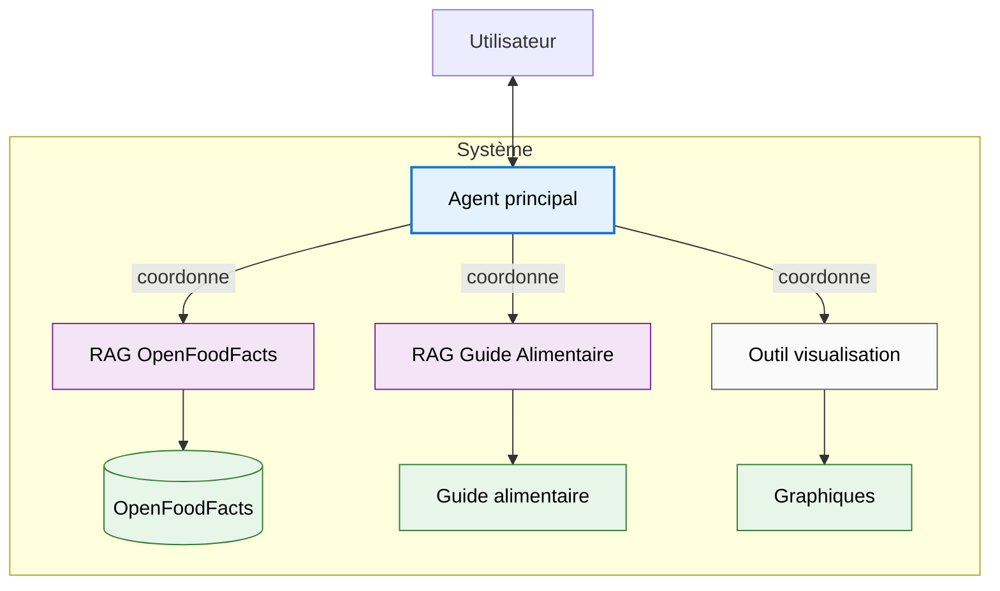

# IFT-6005 - Projet intégrateur - H25 - Université Laval Rapport de description et de planification 

# Agent conversationnel pour l'interrogation de la base de données Open Food Facts

**Auteur** : Alain Boisvert  
**Date** : 2025-01-22 14:00

---

## 1. Description du projet

L'accès à des informations nutritionnelles fiables et la comparaison de produits alimentaires sont des enjeux importants pour les consommateurs qui souhaitent faire des choix éclairés pour leur alimentation. Bien que des bases de données
comme [Open Food Facts](https://world.openfoodfacts.org/) contiennent une grande quantité d'informations sur les produits alimentaires, leur exploitation n'est pas toujours intuitive pour l'utilisateur moyen qui préférerait poser des questions en langage naturel.

L'objectif principal est de développer un agent conversationnel capable d'interroger une base de données contenant des informations 
sur près de 95 000 produits alimentaires canadiens d'[Open Food Facts](https://world.openfoodfacts.org/). Le système devra :

- Interpréter des questions en langage naturel (multilingue) sur les produits alimentaires
- Générer et exécuter des requêtes appropriées sur la base de données
- Fournir des réponses pertinentes sous forme de texte, tableaux ou visualisations
- Compléter les réponses avec des informations du [Guide alimentaire canadien](https://guide-alimentaire.canada.ca/fr/) 
  si nécessaire
- Permettre différents types d'analyses et de comparaisons entre produits

Le projet inclut&nbsp;:

- Développement d'un système d'agent RAG 
- Utilisation des produits canadiens de la base Open Food Facts
- Support multilingue des requêtes et réponses
- Visualisations des données pertinentes
- Documentation technique et pédagogique complète
- Métriques d'évaluation de la qualité des réponses

Le projet n'inclut pas&nbsp;:

- Interface utilisateur graphique (utilisation en ligne de commande)
- Mise à jour en temps réel des données Open Food Facts
- Reconnaissance vocale des questions
- Déploiement en production

## 2. Approche technique

Le système s'appuiera sur une architecture agent-RAG où un agent principal intelligent coordonne l'utilisation de RAG et d'outils spécialisés.

- Un **Agent principal** agira comme un gestionnaire intelligent qui :
  - Analyse les intentions de l'utilisateur
  - Planifie la séquence d'actions nécessaires
  - Coordonne l'utilisation des RAG et outils
  - Assure la cohérence des réponses
  - Gère le dialogue avec l'utilisateur
- Deux outils RAG (*Retrieval Augmented Generation*) seront utilisés :
  - **RAG OpenFoodFacts** pour interroger les données Open Food Facts
  - **RAG Guide alimentaire** pour interroger le Guide alimentaire canadien
- Un **Outil de visualisation** sera utilisé pour générer des graphiques.

Cette architecture permet d'exploiter les forces des agents (planification, prise de décision) et des RAG (recherche d'information), tout en maintenant une séparation claire des responsabilités.

## 3. Plan d'exécution

Le développement du système sera organisé en quatre phases, pour un total de 150 heures, incluant toute la documentation :

**Phase 1 : Agent principal et configuration (40h)**
- Configuration de l'environnement de développement et gestion du projet (5h)
- Développement de l'agent principal avec ses capacités de base de planification et de prise de décision (20h)
- Mise en place de DuckDB et intégration des données OpenFoodFacts (8h)
- Conception et exécution des tests initiaux de l'agent principal (5h)
- Rédaction documentation initiale de l'architecture (2h)

**Phase 2 : RAG OpenFoodFacts (45h)**
- Développement du RAG OpenFoodFacts (20h)
  - Implémentation du système de traduction langue naturelle vers SQL
  - Mise en place du système de recherche sémantique
  - Tests unitaires du RAG
- Intégration du RAG avec l'agent principal et optimisation de leurs interactions (15h)
- Réalisation des tests d'intégration RAG-Agent (5h)
- Documentation du RAG et des interactions (5h)

**Phase 3 : RAG Guide alimentaire et Outil visualisations (40h)**
- Développement et test du RAG Guide Alimentaire (15h)
- Implémentation et intégration de l'outil de visualisation (10h)
- Amélioration des capacités de planification de l'agent principal (8h)
- Tests d'intégration du système complet (5h)
- Documentation des nouveaux composants (2h)

**Phase 4 : Évaluation et documentation (25h)**
- Développement et application des métriques de performance (7h)
  - Évaluation de la qualité des décisions de l'agent
  - Mesure de la pertinence des réponses des RAG
  - Analyse des temps de réponse
- Tests exhaustifs du système complet (7h)
- Rédaction de la documentation technique et du guide utilisateur (5h)
- Préparation du rapport final incluant l'analyse des résultats, les difficultés rencontrées et les améliorations possibles (3h)
- Préparation d'une capsule vidéo pour présenter le projet (3h)

**Calendrier de réalisation** :
- Semaines 1-2 : Phase 1 - Agent principal opérationnel et documenté
- Semaines 3-5 : Phase 2 - RAG OpenFoodFacts intégré et testé
- Semaines 6-8 : Phase 3 - Système complet avec RAG Guide alimentaire et Outil visualisations
- Semaines 9-10 : Phase 4 - Évaluation, documentation et rapport final

## 4. Gestion des risques

Les risques potentiels du projet seront identifiés et évalués régulièrement pour minimiser leur impact sur le calendrier et la qualité du livrable.

- **Performances des LLMs** : Risque lié à la qualité des réponses générées par les modèles de langage
  - Mitigation : Tests précoces avec différents modèles, optimisation des prompts
- **Qualité des données Open Food Facts** : Risque de données manquantes ou incorrectes dans la base de données
  - Mitigation : Aucune idée puisque je connais pas le domaine de l'alimentation
- **Complexité de l'intégration des composantes** : Risque de conflits ou de dysfonctionnements entre l'agent et les outils RAG et visualisation
  - Mitigation : Architecture modulaire, tests d'intégration réguliers
- **Temps de développement sous-estimé** : Risque de ne pas respecter les délais prévus
  - Mitigation : Priorisation des fonctionnalités, approche itérative

Le suivi des risques se fera via les actions suivantes :

- Révision régulière des priorités
- Documentation des problèmes rencontrés et solutions
- Points de contrôle aux deux semaines avec le professeur Luc Lamontagne
- Possibilité de réduire la portée de certaines fonctionnalités si nécessaire

## 5. Critères de succès

- Le système répond correctement à 80&nbsp;\% des requêtes de test
- Temps de réponse moyen inférieur à 5 secondes
- Support effectif d'au moins 3 langues (français, anglais, espagnol)
- Documentation claire et complète
- Tests couvrant au moins 80&nbsp;\% du code
- Capacité à gérer les différents types de requêtes définis dans les objectifs

## 6. Livrables

## 6. Livrables

- **Description et planification du projet intégrateur** :
  Ce document présentant les objectifs, l'approche technique et le plan d'exécution.

- **Rapport de mi-session** détaillant les choix technologiques :
  - Évaluation comparative des modèles de langage (Mistral-7B vs. DeepSeek-R1-7B)
  - Analyse des plateformes d'exécution (Ollama vs. alternatives)
  - Comparaison des bases de données (DuckDB vs. Parquet)
  - Évaluation des frameworks pour les agents et RAG (smolagents de Hugging Face vs. AgentWorkflow de LlamaIndex)
  - Critères d'évaluation utilisés (performance, facilité d'intégration, maintenance)
  - Justification détaillée des choix finaux
  - État d'avancement du projet

- **Rapport final** comprenant :
  - Architecture détaillée du système
  - Analyse des performances (agent et RAGs)
  - Difficultés techniques rencontrées et solutions
  - Améliorations possibles et perspectives
  - Évaluation des critères de succès
  - Leçons apprises

- **Dépôt GitHub** contenant :
  - Code source documenté
  - Guide technique d'installation et d'utilisation
  - Documentation pédagogique expliquant :
    - Architecture agent/RAG
    - Interactions entre composants
    - Exemples détaillés d'utilisation
  - Jeux de tests et métriques
  - Notebooks de démonstration

- **Capsule vidéo de 10 minutes** présentant :
  - Objectifs du projet
  - Architecture développée
  - Démonstration du système
  - Présentation des résultats
  - Défis et apprentissages
