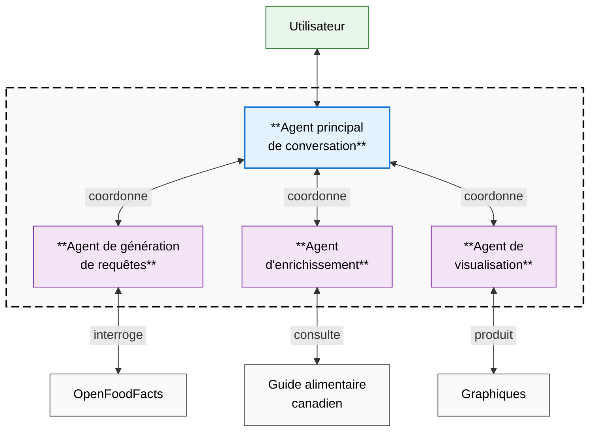

# IFT-6005 - Projet intégrateur - H25 - Université Laval Rapport de description et de planification 

# Agent conversationnel pour l'interrogation de la base de données Open Food Facts

**Auteur** : Alain Boisvert  
**Date** : 2025-01-22 14:00

---

## 1. Description du projet

L'accès à des informations nutritionnelles fiables et la comparaison de produits alimentaires sont des enjeux importants pour les consommateurs qui souhaitent faire des choix éclairés pour leur alimentation. Bien que des bases de données
comme [Open Food Facts](https://world.openfoodfacts.org/) contiennent une grande quantité d'informations sur les produits alimentaires, leur exploitation n'est pas toujours intuitive pour l'utilisateur moyen qui préférerait poser des questions en langage naturel.

L'objectif principal est de développer un agent conversationnel capable d'interroger une base de données contenant des informations 
sur près de 95 000 produits alimentaires canadiens d'[Open Food Facts](https://world.openfoodfacts.org/). Le système devra :

- Interpréter des questions en langage naturel (multilingue) sur les produits alimentaires
- Générer et exécuter des requêtes appropriées sur la base de données
- Fournir des réponses pertinentes sous forme de texte, tableaux ou visualisations
- Compléter les réponses avec des informations du [Guide alimentaire canadien](https://guide-alimentaire.canada.ca/fr/) 
  si nécessaire
- Permettre différents types d'analyses et de comparaisons entre produits

Le projet inclut&nbsp;:

- Développement d'un système d'agents RAG 
- Utilisation des produits canadiens de la base Open Food Facts
- Support multilingue des requêtes et réponses
- Visualisations des données pertinentes
- Documentation technique et pédagogique complète
- Métriques d'évaluation de la qualité des réponses

Le projet n'inclut pas&nbsp;:

- Interface utilisateur graphique (utilisation en ligne de commande)
- Mise à jour en temps réel des données Open Food Facts
- Reconnaissance vocale des questions
- Déploiement en production

## 2. Approche technique

Le système sera construit selon une architecture à base d'agents multiples :

- **Agent principal de conversation** 
  - Gère le dialogue avec l'utilisateur
  - Coordonne les autres agents
  - Assure la cohérence des réponses
- **Agent de génération de requêtes**
  - Transforme les questions en langage naturel en requêtes sur les données Open Food Facts
  - Gère les différents types de requêtes (recherche, comparaison, analyse)
- **Agent d'enrichissement**
  - Recherche des informations complémentaires dans le Guide alimentaire canadien
  - Intègre ces informations aux réponses
- **Agent de visualisation**
  - Génère des représentations visuelles pertinentes
  - Choisit le format de présentation optimal

FIGURE 1 
**Architecture du système conversationnel**

Les technologies utilisées seront les suivants :

- **Python 3.10+** : Langage de programmation principal
- **DuckDB** : Base de données pour interroger les données Open Food Facts
- **Mistral-7B et DeepSeek-R1-7B** : Modèles de langage pour l'interprétation des questions et la génération de réponses
- **Ollama** : Plateforme pour exécuter les modèles de langage
- **Matplotlib** : Bibliothèque pour la génération de visualisations
- **pytest** : Framework pour les tests automatisés

## 3. Plan d'exécution

Les étapes du projet seront réparties en quatre phases distinctes, chacune visant à atteindre des objectifs spécifiques:

- **Phase 1&nbsp;: Configuration et prototype initial (25h)**
  - Configuration de l'environnement de développement (3h)
  - Mise en place de la base DuckDB avec les données Open Food Facts (5h)
  - Développement d'un prototype simple de requêtes basiques (12h)
  - Tests initiaux et validation du concept (5h)
- **Phase 2&nbsp;: Développement du cœur du système (35h)**
  - Implémentation de l'agent principal et de l'agent de génération de requêtes (15h)
  - Développement des fonctionnalités de base de requêtes (10h)
  - Mise en place du système de tests automatisés (5h)
  - Intégration des premiers retours et corrections (5h)
- **Phase 3&nbsp;: Fonctionnalités avancées (25h)**
  - Implémentation de l'agent d'enrichissement (8h)
  - Développement de l'agent de visualisation (8h)
  - Amélioration du support multilingue (4h)
  - Tests d'intégration des fonctionnalités avancées (5h)
- **Phase 4&nbsp;: Évaluation et documentation (15h)**
  - Développement des métriques d'évaluation (5h)
  - Tests exhaustifs et optimisation des performances (5h)
  - Rédaction de la documentation technique et pédagogique (5h)

Le calendrier de développement et les jalons clés seraient répartis comme suit :

- **Semaines 1-2**&nbsp;: Phase 1 avec comme livrable un prototype fonctionnel pour requêtes simples
- **Semaines 3-5**&nbsp;: Phase 2 avec comme livrable un système multi-agents opérationnel
- **Semaines 6-8**&nbsp;: Phase 3 avec comme livrable l'intégration complète des fonctionnalités avancées
- **Semaines 9-10**&nbsp;: Phase 4 avec comme livrable la documentation et les tests finalisés

## 4. Gestion des risques

Les risques potentiels du projet seront identifiés et évalués régulièrement pour minimiser leur impact sur le calendrier et la qualité du livrable.

- **Performances des LLMs** : Risque lié à la qualité des réponses générées par les modèles de langage
  - Mitigation : Tests précoces avec différents modèles, optimisation des prompts
- **Qualité des données Open Food Facts** : Risque de données manquantes ou incorrectes dans la base de données
  - Mitigation : Aucune idée puisque je connais pas le domaine de l'alimentation
- **Complexité de l'intégration des agents** : Risque de conflits ou de dysfonctionnements entre les agents
  - Mitigation : Architecture modulaire, tests d'intégration réguliers
- **Temps de développement sous-estimé** : Risque de ne pas respecter les délais prévus
  - Mitigation : Priorisation des fonctionnalités, approche itérative

Le suivi des risques se fera via les actions suivantes :

- Révision régulière des priorités
- Documentation des problèmes rencontrés et solutions
- Points de contrôle aux deux semaines avec le professeur Luc Lamontagne
- Possibilité de réduire la portée de certaines fonctionnalités si nécessaire

## 5. Critères de succès

- Le système répond correctement à 80&nbsp;\% des requêtes de test
- Temps de réponse moyen inférieur à 5 secondes
- Support effectif d'au moins 3 langues (français, anglais, espagnol)
- Documentation claire et complète
- Tests couvrant au moins 80&nbsp;\% du code
- Capacité à gérer les différents types de requêtes définis dans les objectifs

## 6. Livrables

- Code source sur GitHub
- Documentation
  - Guide technique
  - Documentation pédagogique sur les agents
  - Exemples d'utilisation
- Jeux de tests
  - Suite de tests automatisés
  - Jeu de requêtes d'évaluation
  - Métriques de performance
- Rapport final
  - Analyse des résultats
  - Difficultés rencontrées
  - Améliorations possibles